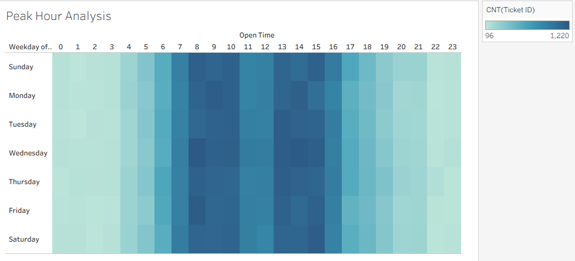

# 📡 Telco FTTH Performance Analysis (BSD Cluster)

 

## 📋 Executive Summary
Project ini mensimulasikan peran **Performance Analyst** untuk mengevaluasi kualitas jaringan Fiber To The Home (FTTH) di area BSD City. Menggunakan dataset **100.000 tiket** (Jan - Des 2025), analisis ini bertujuan untuk mengidentifikasi inefisiensi teknisi dan pola gangguan infrastruktur.

**Key Result:** Ditemukan tingkat kegagalan SLA (Breach Rate) mencapai **18% pada teknisi tertentu**, serta dominasi masalah infrastruktur fisik (*Fiber Cut*) yang memerlukan waktu perbaikan rata-rata 5.7 jam.

## 📊 Dashboard Preview

*(Tableau Dashboard: Memonitor KPI MTTR dan Breakdown Masalah)*

## 💼 Business Context
* **Problem:** Meningkatnya komplain pelanggan akibat durasi perbaikan yang lama (>4 Jam) dan risiko penalti Managed Service.
* **Objective:**
  1. Menurunkan MTTR (Mean Time To Repair) agar sesuai target SLA (4 Jam).
  2. Mengidentifikasi teknisi *Underperformer* untuk program *re-training*.
  3. Mengoptimalkan jadwal shift teknisi berdasarkan pola jam sibuk (*Peak Hour*).

## 🔍 Key Data Insights
Berdasarkan analisis SQL terhadap 100.000 data historis:

### 1. The "Skill Gap" (Inefisiensi Manpower)
Terdapat kesenjangan performa yang ekstrem antar teknisi:
* **Underperformers:** Teknisi **Andi Wijaya** dan **Tono Sudirjo** memiliki Breach Rate tertinggi (**18.2%** dan **16.5%**).
* **Top Performers:** Teknisi seperti **Budi Santoso** dan **Rudi Salim** mampu menjaga Breach Rate di angka **~2%** dengan beban kerja yang setara (~5000 tiket).
* **Action:** Perlu *pairing* kerja antara teknisi senior (Budi) dengan teknisi junior (Andi) serta penundaan pemberian tiket *Critical* untuk teknisi yang performanya rendah.

### 2. Root Cause Analysis
* **SLA Killer:** Masalah **Fiber Cut (Kabel Putus)** memiliki rata-rata pengerjaan **5.72 Jam**. Karena target SLA adalah 4 jam, insiden ini hampir pasti menyebabkan penalti.
* **High Volume:** Masalah **Konfigurasi Logic** menyumbang volume tertinggi (34.885 tiket) namun sangat cepat diselesaikan (0.58 Jam).
* **Action:** Audit vendor sipil untuk perbaikan kabel putus & implementasi *Auto-Config Bot* untuk mengurangi beban tiket Logic.

### 3. Peak Hour Strategy
* **Danger Zone:** Trafik tiket konsisten tinggi (rata-rata 8.000 tiket/jam) pada pukul **08:00 - 16:00 WIB**.
* **Action:** Penerapan *Staggered Shift* (Shift Bertingkat), dimana gelombang kedua teknisi masuk pada pukul 10:00 untuk membackup beban puncak di siang hari.

## 🛠️ Tech Stack & Methodology
1.  **Python (Pandas):** Generating 100k dummy dataset dengan algoritma *Weighted Randomness* untuk simulasi pola jam kerja & skill teknisi.
2.  **SQL (SQLite):** Melakukan agregasi performa, kalkulasi selisih waktu (MTTR), dan ranking teknisi.
3.  **Tableau:** Visualisasi interaktif untuk operasional monitoring.

## 📂 Repository Structure
* `scripts/`: Kode Python generator & Query SQL.
* `docs/`: Dokumentasi lengkap hasil query ([Lihat ANALYSIS.md](docs/ANALYSIS.md)).
* `dashboard/`: Aset gambar visualisasi.

---
*Disclaimer: Project ini menggunakan dummy data untuk keperluan simulasi portofolio.*
